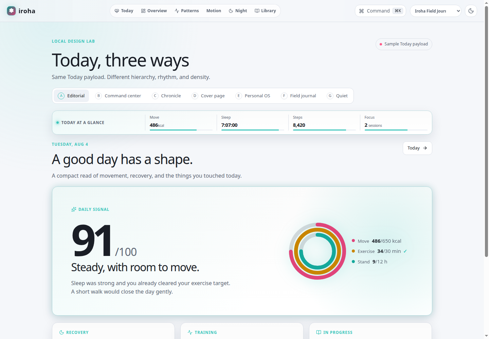

# iroha

_iro & hana_ — a personal data cockpit.

[](LICENSE) [](apps/iroha-server/go.mod)
[](docs/data-model.md)

Iroha lets you own your personal data end to end: keep the **raw exports**, normalize them into a **durable Postgres/PostGIS store**, and publish only **sanitized derived views**. Running and fitness,
sleep, daily Apple Health activity, and media (AniList/Bangumi) consumption history are the current data domains; the architecture generalizes to other personal-history sources.

The cockpit can express the same evidence through six visual languages — atlas, grapher, field journal, phenology, sound map, and archive — without changing the underlying data model. The design lab
below uses sample data so it is safe to share:



## Architecture

Raw files are canonical evidence. The server stores each upload, creates a durable import job, and the separate `iroha-job` worker parses it into typed domain records. Reconciliation uses stable
source keys and content hashes, so unchanged imports are skipped and parser-version changes purge-and-reprocess derived rows instead of appending duplicates.

```text
raw export
  -> tb_raw_files + stored bytes
  -> tb_import_jobs -> tb_jobs
  -> iroha-job / iroha-server parser
  -> reconcile into Postgres/PostGIS
  -> private API and web cockpit
```

The current canonical domains are:

- `tb_activities` — workouts, routes, laps, and time-series samplings.
- `tb_sleep_sessions` — sleep sessions and stage segments.
- `tb_daily_summaries` + `tb_daily_metrics` — Apple Move/Exercise/Stand rings and cross-source-deduplicated daily steps, distance, and flights.
- `tb_media_items` + `tb_media_events` — AniList/Bangumi-synced media consumption history.

Private reads are served under `/api/v1/activities`, `/api/v1/sleep`, `/api/v1/daily`, and `/api/v1/media`; the private control room adds personal tasks and named job actions under `/api/v1/tasks`,
`/api/v1/jobs`, and `/api/v1/actions` — see [API v1 Contract](docs/contracts/openapi.yaml). This surface is unauthenticated by design: iroha is a single-user personal deployment, and the network
boundary (private LAN/NAS, never exposed publicly) is the security control, not an application credential. Sanitized activity and route projections are exported by `make export-public` and published
by the separate static `apps/iroha-public-site`; there is no live `/public/v1` route. The export is a derived view, never the canonical store, and is the only surface meant for public exposure.

## Features

- **Raw-file archive** — every import preserves the original evidence (Apple Health zip, GPX); raw files are the canonical source and are deduplicated by content hash.
- **Incremental Apple Health ingestion** — a full export is treated as a complete snapshot and _reconciled_, not blindly appended: stable per-workout source identity, content-hash change detection,
  and idempotent re-import. A parser-version bump triggers a purge-then-repersist _reprocess_ so counts stay stable instead of duplicating.
- **Multiple Apple Health domains** — the import pipeline extracts workouts, sleep sessions, and daily activity. Daily steps, distance, and flights use source-priority interval deduplication; Apple’s
  ActivitySummary rings are persisted as structured daily summaries.
- **High fidelity** — workout routes linked to their workout (not standalone GPX), HR/pace/distance summaries, laps, and per-sample streams (heart rate, running power/speed, stride, energy) parsed
  from ~millions of `Record` rows via streaming.
- **Background jobs + read surfaces** — `iroha-server` owns ingestion and reads, `iroha-job` claims persisted jobs, and the Svelte cockpit consumes the private API. Public activity/route views are
  sanitized projections.
- **Private control room** — `/admin` keeps daily personal tasks beside recent durable jobs and allowlisted media-sync triggers; the front page exposes the same daily to-go lane for quick access.
- **PostGIS canonical store** — Strava is a legacy import/export adapter only.
- **Media sync** — AniList and Bangumi connectors sync watch/read history into canonical media items and events, with a MAL↔AniList/Bangumi bridge cache for cross-provider resolution.
- **Read response cache** — imported-data reads are cached by canonical request key and invalidated after successful imports; task/job state and mutations always remain live.
- **Contract-checked private API** — per-route rate limiting and a route-inventory test that fails the build if a live route drifts from the OpenAPI contract. Unauthenticated by design; see
  [Auth](docs/iroha-server.md#auth) for the deployment model.
- **Durable geocode** — reverse-geocoded activity locations are cached and refreshed through the job queue, with backoff against upstream rate limits instead of retry storms.
- **Themed cockpit** — a switchable multi-design frontend (grapher, field journal, atlas, phenology, sound-map, and archive themes) sharing one typed theme registry.

## Tech stack

| Layer    | Choice                                                                        |
| -------- | ----------------------------------------------------------------------------- |
| Services | Go 1.26 (`apps/iroha-server`, `apps/iroha-job`), GORM                         |
| Database | PostgreSQL 18 + PostGIS, [goose](https://github.com/pressly/goose) migrations |
| Cache    | Postgres-backed by default (`tb_cache_entries`); Valkey/Redis is optional     |
| Web      | Svelte 5 + Vite (`apps/iroha-web`, [bun](https://bun.sh))                     |
| Tooling  | mise for tools (local and CI), `make` task runner                             |

## Quickstart

Requires [mise](https://mise.jdx.dev/) and Podman for local backend development. A Nix flake remains available as an optional local shell (see `docs/dev-runtime.md`), but nothing requires it.

```sh
mise install           # install the pinned project tools
make db-up             # start Postgres/PostGIS and apply migrations
make dev-up            # start the complete Podman Compose stack
make db-down           # stop local backend containers

# run the server against the dev database (terminal 1)
make run

# run the persisted import worker in another terminal
make run-job

# checks/builds use the same Makefile
make check
make build
```

All lifecycle commands remain Make targets. See [`docs/dev-runtime.md`](docs/dev-runtime.md) for the toolchain boundary and backend workflow.

### Release versioning

`VERSION` is the canonical Iroha product release version. The Makefile derives container tags as `v$(VERSION)`, injects the same value into the web build, and the cockpit shows it subtly in the
brand/footer. A release is marked with the matching Git tag, for example `v0.1.4`.

The Go modules under `apps/` intentionally keep their own `v0.1.0` local requirements because `go.work` and local `replace` directives make them workspace modules, not independently published
libraries. `IROHA_PARSER_VERSION` is separate: it identifies parser behavior and should only change when imports need reprocessing.

The server is configured via `iroha.toml` and/or environment variables:

| Env var                         | Purpose                              | Default                        |
| ------------------------------- | ------------------------------------ | ------------------------------ |
| `IROHA_SERVER_ADDR`             | Listen address                       | `127.0.0.1:8080`               |
| `IROHA_DATABASE_URL`            | Postgres DSN                         | local dev DSN                  |
| `IROHA_DATA_DIR`                | Raw-file storage dir                 | `.iroha-data`                  |
| `IROHA_VALKEY_URL`              | Valkey/Redis DSN                     | local Valkey DSN               |
| `IROHA_CACHE_BACKEND`           | Cache backend (`postgres`/`valkey`)  | `postgres`                     |
| `IROHA_ALLOWED_ORIGINS`         | Private browser origins              | local web origins              |
| `IROHA_PARSER_VERSION`          | Parser build id; bump to reprocess   | `imports.DefaultParserVersion` |
| `IROHA_ANILIST_USERNAME`        | Public AniList username to sync      | —                              |
| `IROHA_ANILIST_TOKEN`           | Optional AniList OAuth token         | —                              |
| `IROHA_BANGUMI_USERNAME`        | Public Bangumi username to sync      | —                              |
| `IROHA_BANGUMI_TOKEN`           | Optional Bangumi PAT                 | —                              |
| `IROHA_BANGUMI_BRIDGE_PATH`     | Optional Bangumi→MAL JSON cache path | —                              |
| `IROHA_MAL_ANILIST_BRIDGE_PATH` | Optional MAL→AniList JSON cache path | —                              |

The private API (`/api/v1`) is unauthenticated by design — iroha is a single-user personal deployment, and the network boundary (private LAN/NAS) is the security control. Do not expose `iroha-server`
directly to an untrusted network; set `IROHA_ALLOWED_ORIGINS` to the web origin(s) that should be allowed to call it.

Smoke-test a real import end to end:

```sh
make smoke-real-import FILE=.iroha-data/imports/your_export.zip
# stronger reconciliation/reprocess checks:
uv run python scripts/real_import_smoke.py .iroha-data/imports/your_export.zip --assert
```

## Documentation

- [MVP v0 Design](docs/mvp-v0-design.md)
- [Iroha Server](docs/iroha-server.md)
- [Import Pipeline](docs/import-pipeline.md)
- [Data Model](docs/data-model.md)
- [Daily Activity Module](docs/activity-module.md)
- [Sleep Module](docs/sleep-module.md)
- [Media Sync Connectors](docs/media-sync-connectors.md)
- [Reading and Watching History Research](docs/media-history-research.md)
- [API v1 Contract](docs/contracts/openapi.yaml) ([decisions](docs/contracts/api-v1-decisions.md), [gap matrix](docs/contracts/api-v1-gap-matrix.md))
- [Frontend Design Contract](docs/frontend-design-contract.md) and [Theme Architecture](docs/frontend-theme-architecture.md)
- [Cache Backends and Invalidation (ADR)](docs/adr/0003-cache-backends-and-invalidation.md)
- [Development Runtime](docs/dev-runtime.md)
- [Roadmap](docs/roadmap.md)
- [Changelog](CHANGELOG.md)

## Contributing

Contributions are welcome — see [CONTRIBUTING.md](CONTRIBUTING.md) for the dev workflow, commit conventions, and code style (oriented from the [Uber Go Style Guide](https://github.com/uber-go/guide)).
Project conventions for humans and agents live in [AGENTS.md](AGENTS.md).

## License

Licensed under the **GNU Affero General Public License v3.0** — see [LICENSE](LICENSE). © 2026 haru.
