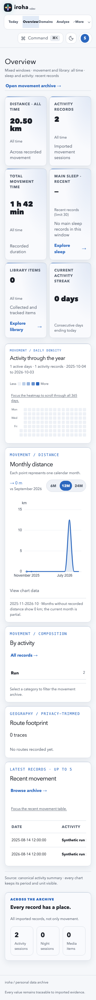
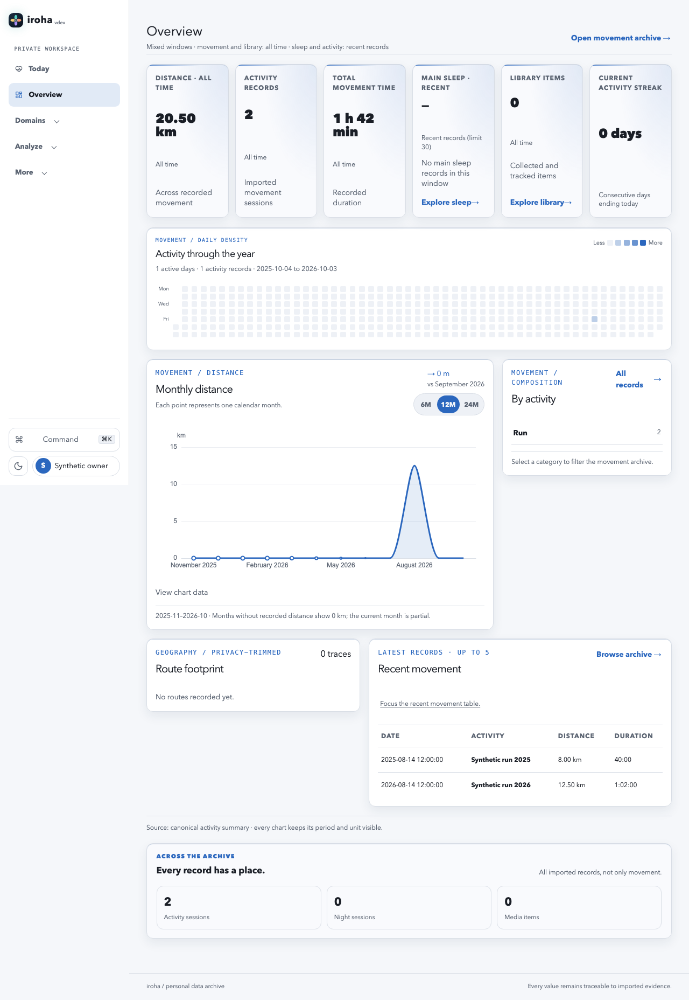
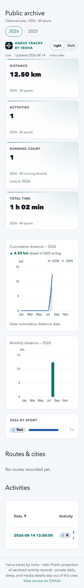
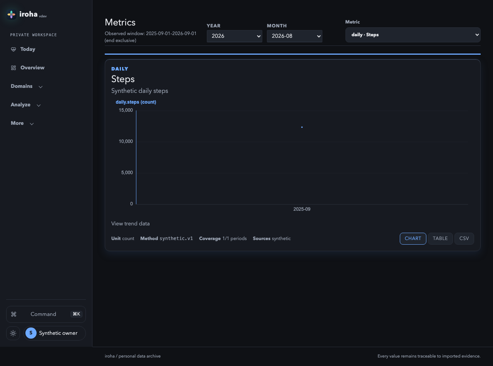

# Cockpit UX review: trustworthy states before visual expansion

Date: 2026-10-03. Baseline: merged main `e06fcad6ee004993a76d2998f3a95d0bc6945872` (PR #118).

Status: review and proposed follow-up, not a redesign implementation or release acceptance. The [improvement plan](../plans/2026-10-03-cockpit-ux-improvements.md) orders the work.

## Scope and workstation record

Owner requested a cockpit review, audit and plan. Followed the workstation-task playbook at tier 1; live coordination is `iroha:cockpit-ux-review` in Asobi. Owning branch is `docs/cockpit-ux-audit`.
Only documentation, synthetic screenshots and a report-only evidence harness belong to this change. No UI, API, dependency, CI, gate, live database, deployment or release changes are authorized.

Reviewed Svelte 5/SvelteKit, ECharts and Grapher's shared assets against `AGENTS.md`, the amended frontend design contract, theme architecture, Phase 1/2 plans and their bounded audits. Applications own
requests and route state; reusable presentation remains in `packages/iroha-shared`. This review does not propose a second design system, chart library or font.

The missing `docs/audits/2026-09-30-v0.6-cockpit-quality.md` was not reconstructed. [Issue #116](https://github.com/azusachino/iroha/issues/116), historical task owners, recoverability, release provenance and
snapshot/ETag acceptance remain separate. Neither pilot completion nor this review closes the full-cockpit quality contract.

### Coverage

| Surface | Evidence actually inspected | Limits |
| --- | --- | --- |
| Private Overview, Expenses, Metrics; public dashboard | Existing 35-case pilot collector: populated light/dark at 320/768/1280; empty/error; scope and chart lifecycle journeys. Screenshots and ARIA records inspected. | Synthetic sparse records; Overview has no routes, sleep or library records. Not representative dense production data. |
| Today, Patterns, Motion/detail, Night/detail, Library/detail, Reports, To-go, Admin | Source walkthrough plus injected first-load HTTP 503 at 320 light, reduced motion: twelve routes, including Expenses as a cross-check. | No populated/empty/recovery/refetch matrix on these nonpilots. No mutations or real backend. |
| Manual | Source and rendered static page at 320 light. | No claim of exhaustive documentation accuracy. |
| Overview reading order | Separate 320×900 geometry probe after populated data. | One sparse fixture, not a usability study. |
| Existing pilot navigation/state safeguards | Focused state, layout and public sorting regressions, reported in the owning PR. | Regression passes do not erase the report-only findings. |

The supplementary collector has 14 cases: twelve failure routes, one static Manual route and one populated Overview geometry probe. All private API responses are intercepted; the supplementary harness
blocks non-local network requests. The existing pilot collector uses its established synthetic API fixtures. No private/live records were inspected or published.

| Domain | Evidence inspected | Result |
| --- | --- | --- |
| Accessibility | ARIA snapshots, navigation/control source, Library canvas source, pilot keyboard diagnostics | F2, F3, F5, F6; screen-reader/browser-wide conformance not tested |
| Layout | Light/dark pilot screenshots, compact geometry, failure screens, internal public table overflow | F7, F8; nonpilot body extents/control clipping need further triage |
| Writing | Error, empty and period wording in rendered ARIA and route/view source | F1, F2, F9 |
| Typography | Pilot screenshots, wrapping and shared stat-tile sizing | F7; no new font recommended |
| Colors | Both pilot modes; bounded DOM contrast diagnostics and chart inspector | No additional actionable color finding in the sampled states; not a complete rendered-paint audit |
| UI polish | Navigation discoverability, selection state, chart/table affordances | F5, F8, F10 |

## What already works

- Pilot headers identify the observed period; Expenses retains its loaded period during deferred changes. Preserve this model rather than reintroducing a full-page loading overlay on refetch.
- Metric/expense views retain exact tables, units, method, source and CSV affordances. Currency totals remain separate.
- Overview discloses its mixed windows. Missing sleep is a dash with explanatory copy, not a fabricated recovery score.
- The populated pilot matrix has no document-level horizontal overflow or uncaught page exception. Public table overflow is internal, not page-level overflow.
- Light/dark screenshots share a restrained visual language. Existing scope, retry and keyboard safeguards are worth retaining; replacing the shell is not the first priority.

## Findings

`Rendered` means observed in this review's synthetic browser run. `Source` means a concrete implementation gap or candidate whose affected populated/refetch journey was not run. Proposed fixes are not
implemented. Locations are relative to the repository root; grouped sources are expanded below.

| ID / severity | Domain | Location / evidence | Before | After | Why |
| --- | --- | --- | --- | --- | --- |
| F1 HIGH | Writing | State adapters/views [S1]; **Rendered**, failure ARIA and screenshots | HTTP 503 coexists with zero totals or “No records”: Motion 0 sessions/0 m, Night 0 sessions/0%, Library 0 titles/no completion records, Reports no canonical records, To-go “Nothing pressing”; Expenses shows no matching expenses and Patterns 0 periods. | Only show genuine empty/zero results after a successful response. Initial failure needs unavailable placeholders; failed refresh keeps explicitly identified last-loaded data. | A failed read is not evidence that personal history is empty. This is a trust defect, not a request to hide errors or retained records. |
| F2 HIGH | Accessibility | `packages/iroha-shared/src/theme-ui/components/MediaBarChart.svelte:108-112`; `theme-ui/grapher/Media.svelte:92-125`; **Source** | Populated Library distributions mount an unlabeled canvas container without an exact-data table; adjacent headings name the topic but do not convey values. | Reuse shared labeled chart/table behavior, retaining categorical semantics and exact counts. | The primary distributions are unavailable without the visual chart. A populated browser/screen-reader journey remains required before implementation acceptance. |
| F3 MEDIUM | Accessibility / writing | Error surfaces [S2]; **Rendered** | Today, Patterns and private detail failures offer no explicit retry. Today, Patterns and Night list already announce alerts; Motion/Library list and private detail errors are plain paragraphs. Reports/Expenses/Admin already have refresh or retry paths. | Use a consistent named retry action and alert/status semantics; keep useful back links. Present “Could not load …” first, with technical details secondary. | Recovery should not require guessing that a date change or browser reload is a retry. Raw endpoint/query strings are poor primary guidance. |
| F4 MEDIUM | Writing | `motion/+page.svelte:228-231`, `library/library-state.svelte.ts:194-197`, `night/night-state.svelte.ts:268-271` under `apps/iroha-web/src/routes`; **Source** | Pagination catches failures without visible feedback while retaining rows. | Keep rows and cursor, show a nearby failed-page message, reuse Load more as retry, clear the message on success. | Preserving content is correct; silence makes failed pagination indistinguishable from an unresponsive control. Second-page failure was not exercised here. |
| F5 MEDIUM | Accessibility | `apps/iroha-web/src/routes/+layout.svelte:52-61`; `apps/iroha-web/src/lib/components/NavigationMenu.svelte:170-176`; shared Grapher `Daily.svelte:55-61`, `Media.svelte:58-63`; **Source + rendered ARIA** | Active navigation and aggregation/family buttons use CSS classes without current/pressed state. | Add `aria-current="page"` to the active route link and appropriate pressed/selected semantics to the existing controls. | Assistive output should identify the current location and selected filter, not require interpreting styling. No navigation regrouping is needed to fix this. |
| F6 MEDIUM | Accessibility | `apps/iroha-web/src/routes/today-state.svelte.ts:210-224`; **Source** | Global day-arrow handler excludes text inputs but does not check modifiers or other interactive contexts. | Ignore modified keys and interactive/dialog contexts; retain day shortcuts in the intended reading context. | The handler can consume browser/navigation or widget shortcuts. Actual native browser-back and dialog journeys were not tested; reproduce those before changing behavior. |
| F7 MEDIUM | Layout / typography | Shared Grapher `Dashboard.svelte:95-115,341-344,613-615`; `packages/iroha-shared/src/components/StatTile.svelte:31-85`; **Rendered**, Figures 1–2 | Six tall summary tiles precede the calendar. At 320×900, the first calendar heading is at y=1179, distance at y=1530 and recent movement at y=2575 CSS px. Scope is repeated in labels, context and supporting text. | First tune this Overview composition: compact numeric summaries, remove redundant scope wording while keeping mixed-window disclosure, retain sleep/library explanations and links. | The page's useful pattern/detail entry points are buried below the first viewport even with only two records. This is a composition issue, not justification for globally shrinking text or hit areas. |
| F8 MEDIUM | Layout / UI polish | `apps/iroha-public-site/src/routes/+page.svelte:663-689,993-995`; **Rendered**, Figure 3 | At 320, the Activities table scrolls internally; Distance/Duration and Pace/HR headers start outside its visible area. There is no explicit scroll/focus cue like private Overview's. | Provide a named, keyboard-reachable scroll treatment and cue, or a compact record layout; retain exact columns and sort behavior. | Intentional overflow still needs discoverability. This review does not claim those columns are permanently unreachable or that page-level overflow exists. |
| F9 MEDIUM | Writing | `apps/iroha-web/src/routes/reports/+page.svelte:145-153,180-190`; shared Grapher `Reports.svelte:170-177`; **Source candidate** | Selected `month` changes immediately, but retained report data/period can remain the previous month's; the view receives both. | Distinguish requested selection from observed report period; retain the loaded report's identity during pending/failed refresh. | Potential scope mislabeling needs a deferred and failed month-change reproduction. The first-load 503 was tested; this retained-data journey was not. |
| F10 LOW | UI polish | `apps/iroha-web/src/lib/navigation.ts:73-95`; `CommandPalette.svelte:97-107`; `routes/manual/+page.svelte:87-88`; **Source**, Figure 4 | Metrics has no Analyze entry. It remains reachable through Manual and metric commands; it is not an orphaned route. | If Metrics is a normal cockpit destination, add one Analyze entry. Otherwise explain its command-first role. | A reviewed pilot is harder to discover than its adjacent analysis pages. This is an owner-facing information-architecture choice, not a broken-route claim. |

### Grouped source locations

S1: `apps/iroha-web/src/routes/expenses/+page.svelte:81-85,528-539`; `motion/+page.svelte:267-271` and shared Grapher `Activities.svelte:79-104`; Grapher `Sleep.svelte:40-57,87-129` summary/history and `Media.svelte:54-55,92-147`;
`reports/+page.svelte:75-107,180-190` and Grapher `Reports.svelte:183-211`; `to-go/+page.svelte:73-103,261,364`; Grapher `Daily.svelte:62-144`. All shared Grapher paths are under
`packages/iroha-shared/src/theme-ui/grapher/`. The retained failure ARIA is authoritative for the exact visible strings; not every adapter has the same underlying state implementation.

S2: `apps/iroha-web/src/routes/+page.svelte:121-123`, `patterns/+page.svelte:34-38`, `motion/[id]/+page.svelte:488-496`, `night/[id]/+page.svelte:238-240`, `library/[id]/+page.svelte:119-121`.

## Screenshots

All figures use synthetic fixtures. The public title is existing public-site branding, not a private account export. Empty maps are fixture limits, not map-rendering defect evidence.

### Figure 1: compact Overview



### Figure 2: desktop Overview



### Figure 3: compact public Activities



### Figure 4: Metrics in the existing shell



Additional [Expenses populated screenshot](evidence/2026-10-03-cockpit-ux/expenses-light-1280.png), [Motion failure](evidence/2026-10-03-cockpit-ux/motion-failure-320.png),
[Reports failure](evidence/2026-10-03-cockpit-ux/reports-failure-320.png) and [Library failure](evidence/2026-10-03-cockpit-ux/library-failure-320.png) accompany the structured records.

## Verification and reproduction

Run from the owning repository with its mise-selected tools and frozen workspace:

```sh
make e2e-pilot-audit OUT=/absolute/workstation/.tmp/iroha-cockpit-ux/pilot.json
IROHA_UX_AUDIT_OUT=/absolute/workstation/.tmp/iroha-cockpit-ux/reproduction \
  make e2e ARGS='--config=../../docs/audits/evidence/2026-10-03-cockpit-ux/playwright.config.ts --workers=1'
make e2e ARGS='e2e/private-states.spec.ts e2e/metric-states.spec.ts e2e/public-states.spec.ts e2e/chrome-layout.spec.ts e2e/public-table-sorting.spec.ts --workers=1'
make fmt-docs-check
make validate
```

The pilot collector passed 35/35 (exit 0), with no unexpected/flaky/skipped case. The supplementary collector passed 14/14 (exit 0), with no page exception and measured document `scrollWidth` equal to 320 in sampled first-failure
screens. That document metric alone is insufficient: body widths were 444 for Patterns, 368 for Motion/Night and 329 for Reports; Admin's Imports/Intake tokens controls also measured outside the initial
viewport. The failure screenshots retain those extents. Intentional nested scrolling versus clipped content still needs route-specific reachability checks; this is not a clean compact-layout verdict. These are **collection passes, not UX conformance**: F1 is plainly present in passing collected evidence. [Structured evidence](evidence/2026-10-03-cockpit-ux/observations.json) retains the relevant
ARIA, measurements and statuses without full browser traces. The retained supplementary harness writes only to the explicitly supplied output directory and is not added to the normal CI test inventory.

The focused state/layout/sorting run passed 83/83 (exit 0). Document/project gates, actual tool versions, independent criterion verdicts and reviewed diff identity are promoted in the owning PR. They do not validate production data,
dense charts, map geometry, account security or real writes.

Not verified: nonpilot populated/empty/deferred/failed-refetch/retry matrix; 375/414-wide route matrix; native 200% zoom in this new review; screen readers; Safari/Firefox; touch hardware; rendered text/mark
contrast across every route; long titles and large inventories beyond existing focused fixtures. The review therefore supplies no route-wide six-dimension quality score or blanket accessibility approval.

Read-only source exploration: `iroha-ux-explorer`, fresh session `ee58cc93-4e81-4390-99fd-3ddecf05d986`, actual `claude-sonnet-5-5`, medium effort, task-created Herdr pane `wV:p51`. The lead checked those source
candidates against its own browser evidence; exploration is not independent acceptance. A separate fresh verifier checks this documentation/evidence delivery before completion.

## Verdict

**Block broader cockpit UX acceptance:** F1 and F2 remain. This is not an instruction to stop the existing deployment or a claim that PR #118 introduced them. Ship the review/plan separately from future
UI fixes. Start with trustworthy states and accessible evidence, then tune the compact Overview; leave a broad chrome redesign until those slices and the expanded route matrix are verified.
