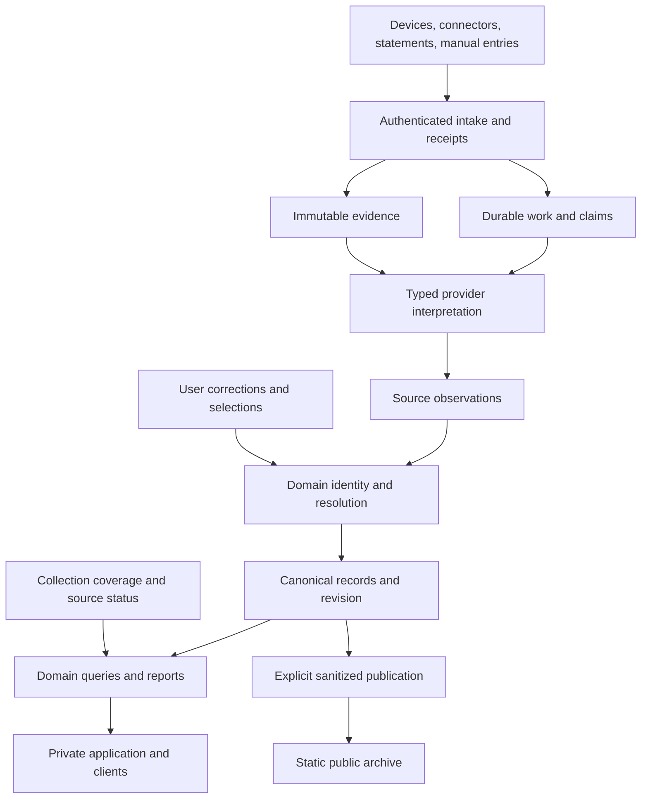

# Iroha clean rebuild: a mature personal data product

Status: proposed alternative architecture and delivery blueprint; not approved implementation scope.

Prepared 2026-09-10 JST from the current Iroha source review at `8f798b0e9d3876897293204b23d63ed855c37421` and the user's explicit correction: the goal is a mature product, not a minimal version. The
user is willing to invest effort. This document proposes the destination, capability boundaries, port strategy, and release gates; detailed module specifications follow review of this blueprint.

## Intent

Rebuild Iroha's internals around reliable personal history, then port and complete the product capabilities on top. Starting from zero means freedom to replace flawed ownership, schema, and workflow
decisions. It does not mean discarding history, accumulated provider knowledge, visual identity, or useful features.

The finished product should collect automatically wherever sources permit, reconcile delayed/conflicting data, provide rich exploration and period comparisons, support corrections and expenses, and
publish deliberately selected public history. It should remain understandable and recoverable when sources fail.

**Implementation stages are sequencing, not a reduction of the final product.** A first working Health slice proves the architecture; it is not the replacement release. Detailed activities, sleep,
media, expenses, reports, source management, tasks, themes, accessibility, and public publishing all remain in the proposed target. Any removal requires an explicit product decision and migration
treatment.

## Relationship to the other proposals

| Proposal                                                                           | Strategy                                                                                     | When to choose                                                                               |
| ---------------------------------------------------------------------------------- | -------------------------------------------------------------------------------------------- | -------------------------------------------------------------------------------------------- |
| [Automatic sync and coverage](2026-09-10-automatic-sync-coverage-and-late-data.md) | Improve specific daily workflows in the current system                                       | Focused improvement without restructuring the full product                                   |
| [Foundations-first rework](2026-09-10-foundations-first-rework.md)                 | Repair current identity, schema, jobs, and consistency boundaries in place                   | Preserve implementation continuity while addressing structural defects                       |
| This blueprint                                                                     | Build a new implementation and migrate targeted capabilities/data with explicit parity gates | Accept the cost of parallel operation and contract migration to obtain a coherent foundation |

These are alternatives, not three mandatory projects in sequence. A clean rebuild still needs selected safety fixes in the legacy system while it remains the active writer; it does not require
completing every in-place refactor first.

Recommendation: if the investment is available, a clean rebuild is reasonable because identity, provenance, reprocessing, and workflow ownership are related structural concerns. Judge the decision by
representative end-to-end prototypes and migration feasibility, not the appeal of a blank repository. Do not commit to a replacement deadline before those risks are measured.

## Product definition

Iroha is the user's private, automatically maintained record of health, activity, media, and spending, with rich retrospective analysis and controlled sharing. It is not dependent on every domain
producing a record every day.

### Primary journeys

1. **Connect and trust:** connect a source, understand what it supplies and what it cannot, see historical import progress, and let future collection run automatically.
2. **Understand the day:** see today's available information, last night's sleep, recent activities, meaningful media updates, and actionable attention items, with honest dates and coverage.
3. **Explore history:** navigate day/month/year/lifetime where meaningful, search and filter records, inspect routes/samples/stages, compare periods, and trace a value to its source.
4. **Resolve disagreement:** inspect candidate matches or conflicting values, choose or correct a result, undo the choice, and retain that decision through future syncs.
5. **Manage expenses:** enter or import transactions, reconcile statements, handle corrections/refunds, and understand category/currency/account totals even when data arrives late.
6. **Review periods:** obtain coherent cross-domain monthly reports and longer-term comparisons that disclose missing inputs and update when history changes.
7. **Share deliberately:** preview a sanitized public snapshot, control included data and route detail, publish a consistent generation, and understand revocation limits for already copied data.
8. **Recover without investigation:** see one actionable source problem, reconnect or retry when necessary, and let durable recovery handle temporary failures.

The ordinary user should not need job IDs, parser names, cron syntax, or SQL to complete these journeys. Detailed diagnostics remain available in administration.

## Target capability and port ledger

This ledger is the proposed final scope, not a claim that each feature already exists or is fully verified. Before implementation, inventory actual routes, APIs, CLI commands, scheduled tasks, and
persisted user data and reconcile them with this ledger. No unlisted capability is implicitly deleted.

| Capability            | Mature target                                                                                                                             | Treatment of current Iroha                                                                                   |
| --------------------- | ----------------------------------------------------------------------------------------------------------------------------------------- | ------------------------------------------------------------------------------------------------------------ |
| Health collection     | Automatic daily/window intake, historical exports, catch-up, corrections, explicit source/device capability and coverage                  | Reuse validated parser knowledge; replace snapshot authority and incremental persistence                     |
| Activities            | Lists, filters, stable detail links, routes, samples, laps, sport-specific metrics, source comparison                                     | Port detailed behavior and reusable rendering; rebuild identity and observation ownership                    |
| Sleep                 | Main sleep/naps, stages, cross-midnight sessions, trends, source disagreements and selection                                              | Port domain rules with boundary fixtures; make selection and provenance explicit                             |
| Daily health          | Rings/goals and supported metrics, source priority, units, sparse data, day/month/year comparisons                                        | Retain tested reducers; represent coverage separately from values                                            |
| Media library         | Connected libraries, progress, ratings, aliases, canonical identities, matching/conflict resolution and source comparison                 | Port current AniList/Bangumi capabilities and selected supported importers; rebuild deterministic resolution |
| Media history         | Exact sessions, dated provider updates, partial-date facts, current state and observation history                                         | Preserve semantic distinctions; exact automatic history requires a capable source                            |
| Expenses              | Manual CRUD, supported statement import, accounts, transaction identity, refunds/credits, corrections, categories and per-currency totals | Migrate user records/edits; expand the ledger contract deliberately                                          |
| Period exploration    | Day/month/year/lifetime where applicable, explicit grain and dimensions, comparison with units/coverage                                   | Preserve functioning scopes; eliminate UI-specific aggregation divergence                                    |
| Reports               | Rich monthly reports, cross-domain comparisons, transparent missing inputs, refreshed historical results                                  | Port current functionality; specify yearly/lifetime summaries separately from monthly report format          |
| Tasks and attention   | Existing personal task workflows plus a distinct queue of actionable source/conflict issues                                               | Inventory and migrate tasks; do not turn system failures into personal to-do obligations                     |
| Private application   | Coherent Today, Overview, activity, sleep, media, expenses, metrics, reports, tasks and administration journeys                           | Reorganize navigation if justified; preserve deep capability and useful deep links                           |
| Design system         | Registered visual identities/compositions, shared primitives, responsive behavior, light/dark support, accessibility                      | Retain assets under shared packages; parity tests across supported themes                                    |
| Public archive        | Reviewed sanitized export, preview, publication generations, refresh/revocation workflow                                                  | Port as a separate read-only surface after the private data/privacy contract is proven                       |
| API and local clients | Typed contracts, pagination, errors, scopes, stable IDs, supported CLI/upload/automation clients                                          | Inventory consumers; preserve or deliberately migrate each compatibility contract                            |
| Operations            | Source health, replay/reprocess, backup/restore, migrations, observability, resource limits, upgrades and recovery                        | Reuse operational knowledge; replace unsafe worker and consistency semantics                                 |

Additional providers are selected by actual use and data capability, not by having a name in an old roadmap. A mature product can clearly say a provider lacks exact session history; fabricating it is
not feature completeness. Native mobile capture is an architectural option if Shortcuts/export tools fail the agreed reliability or fidelity targets, not silently excluded from consideration.

## Proposed architecture

Use a modular Go backend with PostgreSQL/PostGIS, an immutable evidence store, and a Svelte private/public frontend sharing the design package. These technologies preserve valuable skills and assets;
changing them is not necessary to fix the reviewed defects. Runtime/library versions are chosen and pinned during implementation, not copied blindly from the legacy environment.

Prefer one backend module with explicit internal boundaries and API/worker entry points initially. Separate execution processes for long-running work are fine; they must use durable cross-process
contracts. Separate deployment does not require separate Go modules or network services for every domain.

The diagram shows data flow. Module dependencies should follow the capability map below rather than introduce circular imports through the shared workflow.

### Capability map

| Module ID     | Responsibility                                                                         | Depends on                                        |
| ------------- | -------------------------------------------------------------------------------------- | ------------------------------------------------- |
| `platform`    | Configuration, database transactions/migrations, IDs, authentication, safe diagnostics | None                                              |
| `evidence`    | Blobs, source instances, receipts, integrity and retrieval                             | `platform`                                        |
| `work`        | Durable claims, schedules, retry, recovery and attempt history                         | `platform`                                        |
| `health`      | Typed observations, activity/sleep/daily identity, resolution, reducers and reads      | `evidence`, `platform`                            |
| `media`       | Catalog identity, provider state/history/events, matching and reads                    | `evidence`, `platform`                            |
| `expenses`    | Accounts, statements, transactions, corrections and reads                              | `evidence`, `platform`                            |
| `tasks`       | User task lifecycle and existing supported task behavior                               | `platform`                                        |
| `ingestion`   | Provider adapters and workflow orchestration using domain write contracts              | `work`, `evidence`, `health`, `media`, `expenses` |
| `coverage`    | Evidence-backed collection assertions and source delivery policy                       | `evidence`, `platform`                            |
| `reporting`   | Cross-domain queries, period semantics, coverage and comparisons                       | `health`, `media`, `expenses`, `coverage`         |
| `publication` | Privacy policy, export generation and publication records                              | `health`, `media`, `reporting`, `platform`        |
| `delivery`    | HTTP/CLI/application wiring, shared API contracts and read freshness                   | All selected application modules                  |

Coverage writes are orchestrated by ingestion inside the domain-publication transaction; domain packages do not call back into ingestion. A common transaction handle enables atomic composition without
circular module ownership. Shared UI code consumes typed view data, not persistence modules.

This is a proposed module map. It is not a requirement for twelve separately deployed services or twelve folders before the first feature works.

## SQL model: a coherent ownership system

The new schema should be designed from lifecycle and invariants, with executable migrations and an ownership diagram. Do not generate it by copying legacy tables and renaming them.

### Evidence and provenance

- `source_instances`: provider plus specific account/device/export-stream identity, supported capabilities, and reference to credentials held outside raw payloads.
- `evidence_blobs`: immutable content-addressed bytes, checksum, size and storage location. Deduplicate bytes here.
- `source_receipts`: each meaningful acquisition, pointing to a blob and source instance; capture/receipt clocks, input mode, declared interval and trustworthy ordering basis. Identical bytes can have
  multiple receipts.
- Interpretation runs link a receipt, adapter version, durable work, outcome, diagnostics and affected domain records. They are not a second contradictory job state machine.

### Domain records and resolution

Keep domain-shaped tables: activities with observation-owned routes/samples/laps; sleep observations with stages; daily metric observations and selected values; media identities, provider state, dated
facts and exact events; expense accounts, statements and transactions.

Canonical IDs are stable. A provider observation uses a source-instance-scoped key. The canonical object is not owned by the first raw file that happened to create it. Store explicit links from
selected values to the contributing observation/revision and selection rule. User corrections/selections have their own durable precedence and audit trail, surviving source refresh and parser
upgrades.

Use versioned source interpretations where needed to explain and reverse corrections. Retain enough provenance to reproduce a value from evidence and versioned rules. This does not require a universal
event-sourced database or one generic JSON facts table.

SQL must enforce critical business keys, valid relation ownership, and appropriate domain checks. In particular, selected observations must belong to the selecting object; same-source retries cannot
duplicate facts; amount/currency semantics must support the chosen transaction model. JSON is suitable for bounded provider payloads and diagnostics, not a replacement for queryable domain columns and
constraints.

### Coverage and absence

Store source/category/interval assertions linked to accepted receipts and committed interpretations. Distinguish source support, collection completeness, operational health and freshness. Derive
calendar gaps at read time; do not insert synthetic measurements or transactions for missing days.

A successful empty collection may establish a covered-empty interval only if the adapter can distinguish it from missing access or partial retrieval. Coverage is source-scoped: an imported card
statement does not prove all spending is known, and one Health metric does not establish coverage of all Health categories.

### Transaction and read revision

Within one publication transaction, write accepted observations, affected canonical selection, coverage assertions, and a committed revision/invalidation obligation. Readers must not mistake an old
cache for the new revision. Preserve namespace-oriented cache optimization only after query measurement; cache state remains disposable.

Use durable revision counters or a reader-aware transactional invalidation mechanism that works across API and worker processes. Specify read-after-write behavior explicitly. Durable retries alone do
not establish immediate cache freshness.

## Workflow design

### Intake and durable work

Authenticate and validate a bounded payload, store evidence safely, then atomically create its receipt/work reference. Acknowledge durable receipt separately from successful interpretation. Define
repair for filesystem-versus-SQL crash windows, and verify backup alignment.

Workers use claims with attempt fencing, bounded retry, lease-loss cancellation, and ownership checks at publication. Expired terminal attempts are recovered even when no other work exists. Scheduled
and manual work coalesce or serialize per source/account. Idempotency applies to effects; no exactly-once execution promise is needed.

Source fetch cursors can advance once evidence and downstream work are durable. Materialization has its own checkpoint and replayability. Full snapshots, bounded replacements and incremental events
each have explicit authority/deletion rules. Older arrivals cannot supersede newer authority merely because they ran later.

### Reprocessing and corrections

Reprocessing creates a new interpretation of retained evidence, compares changes, and re-resolves affected records under the same authority policy. Preserve canonical identity, user decisions and
facts supported by other sources. For materially changed interpretations, expose a bounded change summary before publication when human selection is required.

Bulk reprocessing supports pause/resume, bounded batches, progress and safe retry. Avoid a global destructive purge and avoid silently leaving mixed semantics without tracking the interpretation
version of affected records.

### Domain-specific arrival policies

- Health: opportunistic daily capture, bounded overlap, gap recovery and source-compatible correction/deletion. Historical exports remain supported without being confused with daily batches.
- Media: automatic library sync and matching maintenance; dated events remain separate from snapshots. Offline periods recover within the provider's real history limits, which are visible.
- Expenses: monthly statements are normal. Their transactions affect occurrence/posted dates according to a declared policy, while receipt time is separate. Corrections refresh historical periods and
  preserve account/currency boundaries.
- Reports: compute from canonical records and collection metadata; late changes revise private reports. Published snapshots have explicit versions and a separate publication lifecycle.

## Mature UX and information architecture

The final experience has three complementary layers, all included in the target:

1. **Everyday use:** Today, Overview, recent changes, tasks and relevant alerts. Useful without manual preparation; one delayed source does not hide the rest.
2. **Deep exploration:** activities and routes, sleep stages, daily patterns, media detail/history, expense reconciliation, metric comparisons and reports. Navigation preserves scope, filter state and
   stable links.
3. **Trust and control:** Connections, source coverage, provenance, conflicting observations, corrections, import/reprocess history, privacy and publication management.

Design a shared time/scope vocabulary, but preserve domain distinctions. Last night's sleep, today's steps, a month-only reading fact, and a late statement must not be forced into one artificial day
model. Calendar closure is not data completeness. Unknown values remain unknown; uncertainty is explained where it affects interpretation.

All adopted themes consume the same semantic view contracts and async behavior. Retain distinct compositions where they are intentional product assets. Accessibility, keyboard navigation, reduced
motion, responsive layouts, loading/error/partial states, and contrast are release criteria for every supported theme, not optional polish.

Offer low-friction corrections with undo and provenance. Notifications should be actionable and deduplicated, with user control; automatic retries should not create notification spam. Source
limitation messages must distinguish unsupported data from broken collection.

Public publishing includes preview and an explicit policy for sensitive fields and route exposure. Never inherit a legacy export default without deliberate review. Publishing produces a consistent
generation; a partial build is not made live. Removing a publication cannot retract copies already obtained by others.

## Reuse strategy: retain knowledge, revalidate code

| Asset                                   | Reuse approach                                                                 | Required evidence                                                           |
| --------------------------------------- | ------------------------------------------------------------------------------ | --------------------------------------------------------------------------- |
| Apple/provider parsers                  | Port into new typed adapter contracts                                          | Real-format fixtures, identity/unit/time tests, streaming/resource behavior |
| Domain reducers                         | Reuse mathematical/domain logic independently of old persistence               | Sparse data, source precedence, overlap and period-weighting fixtures       |
| Media mappings and enrichment knowledge | Import with provenance and versioning                                          | Cross-provider identity/collision/reversal tests                            |
| SQL and ORM persistence                 | Redesign ownership and transactions; port only independently justified queries | Constraint, concurrency, migration and query-plan tests                     |
| Queue code                              | Reuse tested retry algorithms; rebuild claim/publication semantics             | Fenced stale-worker, crash and terminal-recovery tests                      |
| UI assets and themes                    | Preserve shared primitives/identities, adapt to new contracts                  | Full supported route/theme/state accessibility matrix                       |
| API/CLI behavior                        | Port intentional contracts or provide deliberate compatibility adapters        | Consumer inventory, schema and end-to-end contract tests                    |
| Tests                                   | Port as historical examples and regressions                                    | Review expected outputs; legacy output is not automatically correct         |
| Documentation                           | Preserve domain knowledge and decisions; reconcile stale claims                | Each adopted capability has current source and acceptance evidence          |

Do not couple the new implementation to the old database simply to reuse a parser. Do not discard mature domain behavior merely because its current implementation is inconvenient. The port ledger
tracks every keep, redesign, replacement and explicitly approved retirement.

## Delivery program toward the full product

| Stage                                | Deliverable                                                                                                                                                       | Exit gate                                                                                               |
| ------------------------------------ | ----------------------------------------------------------------------------------------------------------------------------------------------------------------- | ------------------------------------------------------------------------------------------------------- |
| A. Product and parity contract       | Complete capability/consumer/data inventory; approved module map; source-specific fidelity and freshness expectations                                             | Every existing capability and irreplaceable data type has a destination or explicit retirement decision |
| B. Architecture proof                | New schema, evidence receipts, fenced work, canonical identity/resolution and committed read revision exercised with representative Health/media/expense fixtures | Replay, old snapshots, partial input, conflicting sources, failure and late data cannot corrupt history |
| C. Domain completion                 | Full targeted Health details, media identity/state/history, expense statements/corrections, tasks and period queries                                              | Domain acceptance matrices pass; supported legacy capability parity is recorded                         |
| D. Product completion                | Everyday and deep-exploration journeys, provenance/resolution controls, all adopted themes, API/CLI compatibility, reports and public publishing                  | End-to-end user journeys and theme/accessibility/error-state matrices pass                              |
| E. Operational maturity              | Automated collection, source policies, observability, backup/restore, migration rehearsal, resource/performance/security testing                                  | Recovery and service objectives are demonstrated under representative load/failures                     |
| F. Migration and parallel validation | Historical data and user decisions migrated; comparison against independently checked truth; new inputs mirrored safely                                           | Reconciled differences, complete ID mapping and no silent missing data                                  |
| G. Replacement release               | Controlled writer cutover, final catch-up, verified rollback, post-cutover observation                                                                            | Full agreed replacement scope accepted; legacy remains available until rollback obligations expire      |

Stages overlap where contracts allow. A vertical slice through all layers should be demonstrated early, and UI research can proceed alongside backend work. Neither changes the final scope or permits
premature replacement release.

Delegate bounded work after boundary contracts and fixtures exist: Health, media, expenses, UI contracts and operational tooling can run independently. A single owner should integrate shared
schema/transaction changes and source-identity decisions. Parallel implementation without those agreements would recreate inconsistent models faster.

Do not estimate this as a short list of cosmetic changes. Cost includes adapter fidelity, complex migrations, test fixtures, operational failure testing, user-data reconciliation, and full surface
parity. Measure early throughput on the architecture proof before estimating the remaining program.

## Migration and cutover

Build against a separate database and separate data-storage namespace. The destination repository/path is not chosen by this proposal and no new checkout is created. Continue using the current Iroha
during development; make only necessary safety fixes there.

1. Inventory raw evidence plus irreplaceable user-authored state: expenses/edits/deletions, tasks, manual media events, matching/selection decisions, settings and publication choices. Raw replay alone
   is insufficient.
2. Restore a consistent legacy DB-and-blob snapshot into a disposable migration environment. Map legacy IDs to new IDs, or preserve them when semantics permit. Maintain redirect/compatibility
   treatment for existing links and clients.
3. Replay/import in deterministic source order using the new authority contract. Import user decisions separately with precedence and tombstones. Keep a migration ledger with per-entity results and
   evidence references.
4. Compare identities, counts, values, dates, units, relationships, route/sample fidelity, reports and visibility. Differences caused by fixing a known legacy error must be explained against source
   evidence; do not force bug-for-bug parity.
5. During parallel validation, mirror durable input evidence with independent cursors. Never let two implementations concurrently mutate the same canonical tables. Record source offsets/receipts and
   any inputs that cannot be mirrored.
6. At cutover, pause old writes or establish a verified change-capture boundary, drain/catch up to a recorded watermark, reconcile final deltas, then switch writers and clients. Publish the new public
   generation only after privacy and completeness checks.
7. Keep rollback capability. New user writes after cutover must be exportable/replayable into the rollback path, or require an explicit write pause and reconciliation; restoring an old snapshot alone
   loses those writes.
8. Retire the legacy system only after the observation period, backup verification and acceptance. No old data deletion is implied by completing a port.

## Mature release acceptance

Targets below are proposed initial budgets to validate on the real hardware/dataset. They are not measured current performance or unconditional promises about external providers.

| Dimension            | Required acceptance                                                                                                                                                                                                                 |
| -------------------- | ----------------------------------------------------------------------------------------------------------------------------------------------------------------------------------------------------------------------------------- |
| Feature completeness | Every agreed port-ledger item is tested, migrated and usable; internal milestones do not count as a mature replacement                                                                                                              |
| Data integrity       | No unexplained record/relationship loss, duplicate effects, source-time substitution, or overridden user decision in replay/correction tests                                                                                        |
| Recovery             | Crash at each publication boundary, stale lease, empty-queue terminal recovery, retry exhaustion and prolonged source outage have tested outcomes                                                                                   |
| Freshness            | Source-specific delivery expectations, receipt-to-ingestion lag and coverage gaps are visible; server ingestion target initially p95 under five minutes for normal bounded batches, measured separately from device/provider delays |
| Read responsiveness  | Initial target p95 under 500 ms for common non-export reads on a representative ten-year fixture; expensive history/route/export queries are bounded/paginated or asynchronous                                                      |
| Late data            | Historical lists/metrics/reports update after corrections and statement imports, including primed caches and cross-month changes                                                                                                    |
| Security/privacy     | Scoped ingestion credentials, private API access, safe payload limits/diagnostics, publication allowlists and negative leakage tests                                                                                                |
| Usability            | Daily use needs no routine export/sync clicks for supported sources; corrections and actionable failures can be handled without developer tools                                                                                     |
| Accessibility        | Supported themes/routes/states pass keyboard, focus, contrast, reduced-motion and compact-layout checks                                                                                                                             |
| Operations           | Backup/restore includes DB and evidence; upgrade and rollback preserve new writes; resource limits and observable failure reasons are exercised                                                                                     |
| Device reality       | At least a two-week normal-use trial covers lock state, unavailable network, missed days, delayed samples and recovery; unsupported guarantees remain explicit                                                                      |

Use unit tests for domain semantics, real Postgres integration tests for constraints/transactions/concurrency, contract tests for all consumers, browser tests for journeys/themes, and
fault-injection/recovery tests for operational boundaries. Existing `make` gates remain the project entry points; the replacement should expose equally clear targets. No fixed code-coverage percentage
substitutes for the required scenarios.

## Decisions needed before module implementation

- Confirm the port ledger against actual daily use and existing API/CLI clients. The default here preserves capabilities, not a minimal subset.
- Choose the automatic Health transport through fidelity/reliability trials; budget a native client if external tooling cannot meet the agreed needs.
- Identify actual media services and initial financial statement/account formats, including credits/transfers and transaction-date interpretation.
- Agree deployment/storage location, backup recovery objectives and acceptable source-specific delays using real operating constraints.
- Decide repository destination and cutover/compatibility policy. This document does not choose a new repository, deploy software, or retire the existing app.

The desired outcome is a complete, trustworthy successor: coherent data ownership, safe automation, rich domain experiences, explainable corrections, and maintainable operations. The effort should go
into proving those capabilities together, rather than reproducing the current screen count on another uncertain foundation.

## Evidence and verification boundary

The two linked reviews contain the concrete source findings behind this architecture: full-versus-partial reconciliation, old-file reprocessing, split provenance, SQL ownership gaps, false job
success, stale claims, terminal recovery, and cross-process cache visibility. Existing capability documents and roadmap were consulted as an inventory aid; several describe historical or proposed
behavior and are not treated as verified implementations.

This is a written alternative, not an implemented rebuild or a completed product audit. No live integrations, migrations, performance tests or device trials were run. Documentation formatting is
checked separately; the earlier full repository gate was blocked by tool-download certificate errors. Unrelated working-tree changes are outside this proposal.
