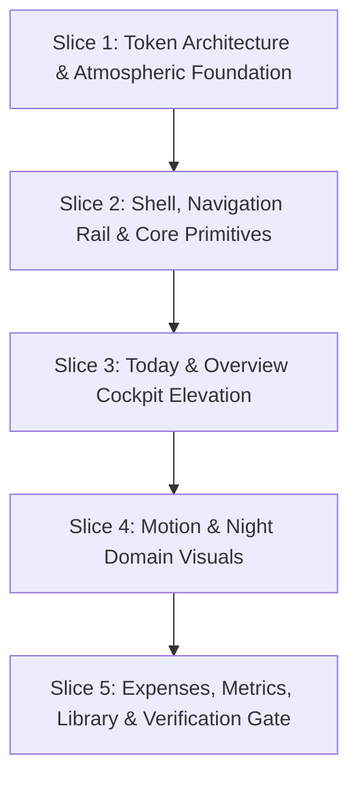

# Cockpit visual overhaul: eliminating the "grey style" for an athletic, vibrant data cockpit

Date: 2026-10-08
Status: Draft proposal & implementation roadmap
Target workspace: `apps/iroha-web` & `packages/iroha-shared`
Reference baseline: main `9cef5a7`

---

## 1. Context & Motivation

Following the visual and performance improvements delivered to the public site (PR #131 / #132), the user identified that the private cockpit dashboard suffers from an unloved, dreary "grey style" that gives the private product a low visual reputation:

> *"hinder site, the private site had low reputation on the style and everything now. the grey style, I dont like it; plz do research and write an issue, plan for now."*

While previous engineering passes (v0.6 audit and remediation in #116 / #126) established strict mechanical conformance—zero overflows, valid touch targets ($\ge 24\text{px}$), accessible contrast ratios, and truthful state handling—the **visual design and emotional resonance** remained stunted in an austere, desaturated, wireframe-like aesthetic.

The goal of this overhaul is to transform the private cockpit from a drab, bureaucratic "grey spreadsheet" into a vibrant, high-contrast, athletic personal data cockpit with deep obsidian dark mode, crisp elevated studio light mode, domain-color-coded tiles, and refined tactile geometry.

---

## 2. Root Cause Analysis: The "Grey Style" Malaise

A visual and codebase audit of `apps/iroha-web` and `packages/iroha-shared` identified five primary architectural causes of the grey aesthetic:

### 2.1 Monochromatic & Low-Contrast Surface Architecture
- **Dark Mode**: Uses a flat charcoal canvas (`--bg: #0f1115`), surface (`--surface: #171a21`), and elevated surface (`--surface-2: #1f242d`). Because the background is relatively bright dark-grey with near-zero chroma, components lack depth and contrast, resulting in a murky "grey haze" across the viewport.
- **Light Mode**: Built on flat grayish-blue canvas (`--bg: #f5f7fa`) with chalky white cards (`--surface: #ffffff`) and flat grey borders (`--border: #d9dee6`). It reads as an unstyled administrative form or clinical audit tool rather than a modern personal cockpit.

### 2.2 Desaturated "Grapher" Token Hijack
- In `packages/iroha-shared/src/theme/themes.css`, the default design language `[data-language="grapher"]` overrides brand colors with `--accent: #6da9ff` (pale faded denim blue) and `--accent-2: #f07c78` (faded coral). In light mode, it drops to `--accent: #2b67be` (dull navy) and `--accent-2: #b84256` (brick).
- This global override strips away the radiant teal (`#39c5bb` / `#00e5bf`), vibrant magenta (`#ff5c8a`), and athletic amber/emerald accents, imposing a desaturated clinical veil across every view.

### 2.3 Brutalist "Wireframe" Geometry (Zero-Radius Syndrome)
- In several core views, elements are styled with raw 0px borders:
  - `Daily.svelte`: `border-radius: 0;` on aggregation buttons.
  - `Activities.svelte`: `summary-row` is a rigid 3-column wireframe box carved up with 1px border lines; filter dropdowns have sharp 0-radius edges.
  - Tables in `Overview`, `Daily`, and `Activities`: Styled with harsh `border-top: 2px solid var(--text)` and thin 1px row separators without card padding, subtle zebra striping, or visual rhythm.

### 2.4 Complete Absence of Domain Chromatic Identity
- Iroha unifies multiple distinct personal data domains: **Movement / Athletics**, **Sleep / Recovery**, **Health Metrics**, **Expenses**, and **Media**.
- However, the private site renders nearly every domain identically:
  - `Overview`: 6 identical white/grey stat tiles with plain black/white numbers; no sport badges, no color-coded indicators.
  - `Motion`: Monotone stat cards (`1`, `12.50 km`, `1:02:00`) rendered in black/white.
  - `Sleep`: Flat grey boxes with dark navy bars instead of a soothing nocturnal indigo/violet ambiance.
  - `Expenses`: Mud-brown bars and plain white cards instead of crisp financial emerald/mint cues.
- The established domain tokens (`--sport-run`, `--sport-ride`, `--ring-move`, `--ring-exercise`, `--ring-stand`, `--category-*`) exist in `palette.css` but are barely utilized on primary overview cards and tiles.

### 2.5 Flat Surfaces Devoid of Atmospheric Depth
- There is virtually no ambient lighting, surface graduation, or rim lighting.
- Card backgrounds use flat solid colors or faint linear gradients (`rgb(255 255 255 / 0.035)`), with faint, muddy box-shadows.
- The left sidebar (`Shell.svelte`) is a flat 15rem block divided by a single vertical 1px line, with tiny monochrome text links.

---

## 3. Design Vision & Target Visual Language

We establish an **Athletic Cockpit & Elevated Studio** design system:

### 3.1 Dark Mode: The "Obsidian Cockpit"
- **Canvas**: Deep midnight obsidian (`#080a10` to `#0a0d14`), delivering infinite contrast against colored data.
- **Ambient Field**: Subtle, organic radial glow meshes reflecting the primary domain color (e.g., radiant teal for running, indigo for sleep, emerald for expenses).
- **Surfaces**: Layered dark slate cards (`#111520` surface, `#171d2b` elevated) with a 1px top-rim highlight (`inset 0 1px 0 rgba(255, 255, 255, 0.08)`) and soft deep drop shadows (`0 16px 40px rgba(0, 0, 0, 0.45)`).
- **Micro-Borders**: Fine, translucent boundaries (`rgba(255, 255, 255, 0.08)` dark) that gently highlight on hover (`rgba(57, 197, 187, 0.3)`).

### 3.2 Light Mode: The "Elevated Studio"
- **Canvas**: Warm, luminous alabaster (`#f8fafc` / `#f1f5f9`).
- **Surfaces**: Floating pure-white cards (`#ffffff`) with multi-tier soft shadows (`0 1px 3px rgba(0,0,0,0.04), 0 12px 32px rgba(15,23,42,0.06)`), banishing the dreary grey look.
- **Typography**: Crisp high-contrast slate ink (`#0f172a` primary numbers, `#475569` labels).
- **Accents**: Pure, saturated athletic hues (emerald teal `#0d9488`, electric cobalt `#2563eb`, vibrant amber `#d97706`).

### 3.3 Domain Chromatic Identity
Each domain gains immediate visual recognition through color, iconography, and top-accent glow:
- **Movement (Running/Walking/Cycling)**: Radiant Teal (`#00e5bf` / `#0d9488`), Sky Blue (`#38bdf8`), Electric Coral (`#ff5c8a`).
- **Recovery & Sleep**: Midnight Indigo (`#818cf8`), Dream Violet (`#a78bfa`), Soft Cyan (`#22d3ee`).
- **Health Metrics**: Pulse Rose (`#f43f5e`), Apple Rings (Move `#f07c78`, Exercise `#e7b65a`, Stand `#6da9ff`).
- **Financial Ledger**: Mint Emerald (`#10b981`), category-specific pill tags.
- **Media & Library**: Sunset Rose (`#fb7185`), Warm Amber (`#fbbf24`).

### 3.4 Tactile Controls & Rounded Geometry
- Retire all `border-radius: 0;` styling.
- Standardize on cohesive outer radius (`--radius: 14px`) and inner pill radius (`999px`) for segmented controls.
- Period selectors and filters adopt pill segmented controls (as proven in the public site), with solid dark/light active states and crisp typography.

---

## 4. Implementation Slices

Work is structured into 5 cohesive, incrementally verifiable implementation slices:

### Slice 1: Token Architecture & Atmospheric Foundation
- **Files**:
  - `packages/iroha-shared/src/theme/palette.css`
  - `packages/iroha-shared/src/theme/themes.css`
  - `apps/iroha-web/src/routes/app.css`
- **Deliverables**:
  - Introduce Obsidian Dark (`--bg: #080a10`, `--surface: #111520`, `--surface-2: #181f2c`, `--border: rgba(255,255,255,0.09)`).
  - Introduce Elevated Studio Light (`--bg: #f8fafc`, `--surface: #ffffff`, `--surface-2: #f1f5f9`, `--border: #e2e8f0`).
  - Upgrade `grapher` identity tokens: restore saturated, radiant accents (`--accent: #00e5bf` / `#0d9488`, `--accent-2: #ff5c8a` / `#e11d48`).
  - Define domain badge and tile gradient tokens (`--tile-surface-glow`, `--glow-movement`, `--glow-recovery`, `--glow-finance`).

### Slice 2: Shell, Navigation Rail & Core Primitives
- **Files**:
  - `packages/iroha-shared/src/theme-ui/grapher/Shell.svelte`
  - `packages/iroha-shared/src/components/StatTile.svelte`
  - `packages/iroha-shared/src/components/PanelFrame.svelte`
  - `packages/iroha-shared/src/components/MetricPanel.svelte`
  - `apps/iroha-web/src/lib/components/CommandPalette.svelte`
- **Deliverables**:
  - Modernize the left navigation sidebar: sleek brand header, tactile pill-shaped navigation links with luminous active glow, rounded command trigger, and ergonomic spacing.
  - Upgrade `StatTile.svelte`: support domain color highlights, accent top rim-light, tabular metric typography with distinct unit tags, and optional icon slot.
  - Upgrade `PanelFrame.svelte`: modern card elevation, rounded corners, subtle rim borders.
  - Replace raw HTML button controls with rounded pill segmented controls.

### Slice 3: Today & Overview Cockpit Elevation
- **Files**:
  - `packages/iroha-shared/src/theme-ui/grapher/Today.svelte`
  - `packages/iroha-shared/src/theme-ui/grapher/Dashboard.svelte`
  - `packages/iroha-shared/src/theme-ui/components/ActivityHeatmap.svelte`
- **Deliverables**:
  - **Overview (`/overview`)**:
    - Replace the 6 monochrome stat tiles with athletic, domain-colored cards (Distance with teal accent, Records with amber, Movement duration with sky blue, Sleep with indigo, etc.).
    - Heatmap visual ramp upgrade: vivid emerald/teal active day ramps (instead of flat pale blue squares).
    - Monthly distance chart: vibrant gradient area fill and glowing line trace.
    - Recent activities table: rounded card container, clear sport icons, readable tabular typography.
  - **Today (`/`)**:
    - Transform activity indicator bars into rich, modern metric cards with animated numbers and ring gauges.
    - Polish session list items with domain sport accents, subtle hover lifts, and clean time stamps.

### Slice 4: Motion & Night Domain Visuals
- **Files**:
  - `packages/iroha-shared/src/theme-ui/grapher/Activities.svelte`
  - `packages/iroha-shared/src/theme-ui/grapher/ActivityDetail.svelte`
  - `packages/iroha-shared/src/theme-ui/grapher/Sleep.svelte`
  - `packages/iroha-shared/src/theme-ui/components/SleepTimelineChart.svelte`
- **Deliverables**:
  - **Motion (`/motion`)**:
    - Remove wireframe `summary-row` boxes; replace with elevated athletic metric tiles with vibrant sport badges.
    - Replace raw `<select>` filter with styled pill controls.
    - Elevate the movement records table into a sleek floating card with subtle hover highlight.
  - **Sleep / Night (`/night`)**:
    - Apply nocturnal recovery aesthetic: deep indigo/violet surface tones.
    - Aggregate sleep chart: gradient bar fills, clear main-sleep vs nap distinction, legible stage tags.

### Slice 5: Expenses, Metrics, Library & Verification Gate
- **Files**:
  - `packages/iroha-shared/src/theme-ui/grapher/Expenses.svelte`
  - `packages/iroha-shared/src/theme-ui/grapher/Metrics.svelte`
  - `packages/iroha-shared/src/theme-ui/grapher/Media.svelte`
  - `packages/iroha-shared/src/theme-ui/grapher/Reports.svelte`
- **Deliverables**:
  - **Expenses (`/expenses`)**: Mint emerald financial tiles, colorful category breakdown bars, clean ledger table.
  - **Metrics (`/metrics`)**: High-contrast small multiples, clear dimension selectors, cohesive card framing.
  - **Reports & Library**: Rich fact grids, comparative trend curves, tactile asset cards.
  - **Verification**:
    - All existing Playwright test suites (`shared-shell-keyboard`, `today-layout-states`, `private-states`, etc.) must pass.
    - Zero contrast regressions (verify WCAG AA compliance across all light/dark tokens).
    - Zero layout overflows across 320px–1280px viewports.
    - Full pre-commit gates (`make check`) passing.

---

## 5. Verification & Acceptance Criteria

1. **Visual Distinctiveness & Emotional Resonance**:
   - The private site no longer appears grey, monochrome, or wireframe-like.
   - Dark mode presents rich midnight obsidian depth with radiant colored data accents.
   - Light mode presents crisp white floating cards with soft shadows and high-contrast typography.
2. **Domain Differentiation**:
   - Every domain (Movement, Sleep, Health, Expenses, Media) has distinct visual color coding that immediately communicates its context.
3. **Ergonomics & Target Sizes**:
   - All interactive controls retain $\ge 24\times24$ CSS px touch targets (WCAG 2.5.8).
   - Focus rings remain visible (2px solid with 3px offset).
   - Press feedback (`scale(0.96)`) preserved across buttons and pills.
4. **Truthfulness & Data Contracts**:
   - No data calculation, aggregation logic, or API contract is altered.
   - Empty, unavailable, and loading states remain completely truthful.
5. **Quality Gates**:
   - `make check` passes cleanly (Go, Svelte, TypeScript, Python).
   - Web test suites pass without regressions.
