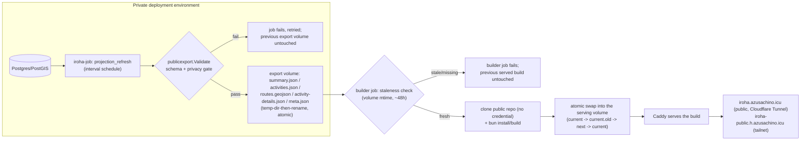

# Public-site publishing workflow

Companion to [roadmap Milestone 7](roadmap.md#milestone-7-privacy-and-publishing). That section says the design; this document is the operational detail an operator needs day to day — the full
pipeline, the review loop, and how to undo a bad publish. Tracks [issue #41](https://github.com/azusachino/iroha/issues/41).

An earlier version of this pipeline committed the exported snapshot to `main` and published via GitHub Pages, using a fine-grained `IROHA_EXPORT_GITHUB_PAT` to push from inside the private network.
That design is retired: nothing in this repo holds a repo-write credential anymore, no GitHub Actions workflow is involved in publishing, and the site is built and served entirely on the deployment
cluster.

## Pipeline

Everything left of `LIVE` runs inside the private network or on infrastructure this repo doesn't own or trust with credentials; nothing publishes by pushing to this repo. The exported activity,
summary, route, and detail files are sanitized projections. `activity-details.json` contains rich detail for every exported activity, including samples and laps when the source has them. Route traces
are included by default; passing `--privacy` is an explicit opt-in that omits every route trace while retaining activity metrics, samples, and laps.

### Validation gate

`publicexport.Validate` and `ValidateActivityDetails` (`apps/iroha-server/pkg/publicexport/validate.go`, `activity_detail.go`) run inside `publicexport.Export` (`export.go`) after the
summary/activities/routes/details are built in memory and before anything is written to disk. It is a regression gate, not a privacy-detection system: it catches a raw (non-`act_`-prefixed) activity
ID, a negative metric, an `ended_at` before `started_at`, or an out-of-range coordinate — the shapes a future change to `Activity`, `Summary`, or route sanitization would produce if it accidentally
bypassed the sanitizer. A failure returns an error before anything is written; `Export`'s temp-directory-then-rename swap means the previously exported volume is untouched either way, and when the
scheduled job kind hits this path the error surfaces through `jobs.Service`'s normal retry/attempts machinery, not a bespoke script exit code.

### Freshness

`meta.json` (`{"generated_at": "..."}`) is written alongside the data files. The public site reads it in `+page.ts` and shows "Data as of \<date\>" in the hero, so a visitor never mistakes the
snapshot for a live feed. Separately, the builder job checks the export volume's freshness (roughly two scheduled intervals, ~48h) _before_ attempting a build — a stale or missing export fails the
builder job loudly rather than quietly rebuilding the site around old data forever.

### Cache boundary

The public archive does not use Iroha's runtime response-cache module and does not call `/api/v1`. Its HTML and sanitized `data/*.json` files are a static build served by Caddy; `IROHA_CACHE_BACKEND`
plays no role here. `meta.json` provides snapshot freshness in the UI. Private `read_reports`, expense records, and cache rows must never be copied into this public build.

### Smoke check

There is no automated post-deploy smoke check yet (the equivalent of the old GitHub Pages workflow's post-`deploy-pages` curl assertions) — this is a known gap, not a design decision, worth adding to
the builder job before fully trusting unattended runs. Until then, the failure modes it would have caught are: the builder job itself failing (visible via `kubectl get jobs`/its own exit status) or a
build that succeeds but renders wrong (currently only caught by manual spot-check, same as the review loop below already accepted for data-only regressions).

## Operator/editor review loop

There is deliberately **no human approval gate** between a data change and publish — that would turn a personal running/media archive into an editorial workflow it doesn't need, and it would fight the
whole point of a scheduled job refreshing it unattended. The review loop is: automated checks first, human spot-check on suspicion, not a sign-off step per publish.

- **The validation gate** (above) is the first automated reviewer — most regressions never leave the private network.
- **The builder job's staleness check** is the second — a silently-stuck export fails the build loudly instead of serving stale content forever.
- **The deployment environment's generic Job monitor** should watch both the `projection_refresh` schedule and the builder `CronJob` for suspension, no recorded run, or repeated failure. No
  application-specific monitor is required.
- **Manual spot-check**: visiting `https://iroha.azusachino.icu/` after a schedule fires. There is no dashboard for "did today's export look right" beyond reading the numbers; that's an acceptable
  cost for a single-operator personal site.

## Rollback path

| Symptom                                                                    | Action                                                                                                                                                                                                                                                                 |
| -------------------------------------------------------------------------- | ---------------------------------------------------------------------------------------------------------------------------------------------------------------------------------------------------------------------------------------------------------------------- |
| A published data snapshot looks wrong (bad numbers or an unexpected field) | Investigate `iroha-job`'s `projection_refresh` logs and the underlying data — there is no git commit to revert, since the export writes directly to a volume. Fix the underlying data or the export logic, then wait for (or manually trigger) the next scheduled run. |
| The builder job itself is broken (bad build step, bad clone)               | Fix forward in this repo, then trigger the builder `CronJob` manually (`kubectl create job --from=cronjob/... ...`) — no data change is required to rebuild.                                                                                                           |
| The export or builder job is producing bad output repeatedly               | Suspend the relevant scheduled job/CronJob using the deployment platform's normal command. This stops further builds while the logic is fixed, without touching whatever is already being served.                                                                      |

A broken builder run is not automatically an outage in the way a broken GitHub Pages deploy wasn't: the atomic swap into the serving volume means a failed build never overwrites the last good one —
but unlike GitHub Pages, there is currently no automated smoke check confirming the _previous_ good build is actually still being served correctly (see "Smoke check" above).

## Current rollout status

Live and self-hosted end to end on the deployment cluster: `iroha-job` runs the `projection_refresh` job kind on an interval schedule, writing the sanitized snapshot to a dedicated volume; a separate
builder job clones this repo's public code, reads that volume read-only, builds `apps/iroha-public-site`, and atomically publishes it to a volume served by Caddy. The site is public at
[iroha.azusachino.icu](https://iroha.azusachino.icu/) via the deployment's Cloudflare Tunnel, and reachable internally at `iroha-public.h.azusachino.icu` for verification. The former GitHub Pages
deployment at `azusachino.github.io/iroha` is retired and no longer updates.

The public site also consumes source-only assets from `packages/iroha-shared`, including the shared activity chart and the `/design` workbench — the builder job's clone always pulls the current state
of both, since it clones the whole repo rather than watching specific paths the way the old GitHub Actions workflow did. The private k3s web image and the public site build remain separate
deployments.

## Local development

`apps/iroha-public-site/static/data/` is never committed (see its `.gitignore` entry) — it's the same "one known snapshot" shape as production, regenerated fresh before every build rather than
carrying a real or stale copy of personal activity data in this public repo. `make public-site-build` (and therefore `make validate`) runs `make public-site-data` first, which calls the same
`iroha-export-public` CLI and `publicexport.Export` function the scheduled job kind uses, against whatever database `IROHA_DATABASE_URL`/`iroha.toml` points at (the local dev stack by default). Use
`make public-site-data PRIVACY=1` to regenerate without route traces.

## Deployment contract

Nothing in this repo holds a publishing credential — there is no PAT, no SealedSecret, and no GitHub Actions secret anywhere in this pipeline. A deployment operator should:

1. Ensure `iroha-job`'s Deployment sets `IROHA_PUBLIC_EXPORT_DIR` and mounts a dedicated volume at that path (see the deployment environment's own manifests) — this is the only new configuration
   `projection_refresh` needs beyond what `iroha-job` already required.
2. Keep the builder job's manifest in the deployment environment, mounting that same volume read-only and a separate volume for its served output. It needs no database credential at all.
3. Verify the export job reaches a successful run (`kubectl -n <namespace> logs deploy/iroha-job` or equivalent), then verify the builder job's own run, then confirm
   [the public site](https://iroha.azusachino.icu/) shows a current `Data as of` timestamp.

If the export job kind never runs, check that `IROHA_PUBLIC_EXPORT_DIR` is actually set — `iroha-job` logs `"IROHA_PUBLIC_EXPORT_DIR not set; projection_refresh job kind disabled"` and skips
registering the job kind entirely when it's missing, rather than failing loudly.
