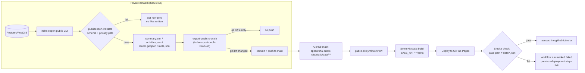

# Public-site publishing workflow

Companion to [roadmap Milestone 7](roadmap.md#milestone-7-privacy-and-publishing). That section says the design; this document is the operational detail an operator needs day to day — the full
pipeline, the review loop, and how to undo a bad publish. Tracks [issue #41](https://github.com/azusachino/iroha/issues/41).

## Pipeline



Every step left of the GitHub push happens inside the private network; nothing there is reachable from the public internet. The only thing that crosses the boundary is the sanitized snapshot, as a git
push.

### Validation gate

`publicexport.Validate` (`apps/iroha-server/pkg/publicexport/validate.go`) runs after the summary/activities/routes are built in memory and before anything is written to `--out`. It is a regression
gate, not a privacy-detection system: it catches a raw (non-`act_`-prefixed) activity ID, a negative metric, an `ended_at` before `started_at`, or an out-of-range coordinate — the shapes a future
change to `Activity`, `Summary`, or route sanitization would produce if it accidentally bypassed the sanitizer. A failure exits non-zero with no partial files on disk, so the cron script's `set -eu`
aborts before any `git add`/`commit`/`push`.

### Freshness

`meta.json` (`{"generated_at": "..."}`) is written alongside the data files. The public site reads it in `+page.ts` and shows "Data as of \<date\>" in the hero, so a visitor never mistakes the
snapshot for a live feed.

### CI smoke check

The last step of `.github/workflows/public-site.yml` curls the deployed `page_url` after `deploy-pages` and asserts:

- the `/iroha` base path root returns the expected title/heading text (confirms the base path and build landed correctly, not a 404 or a root-site default page)
- `data/meta.json`, `data/summary.json`, `data/activities.json`, `data/routes.geojson` are all fetchable under that base path

A failure here fails the workflow run but does **not** take the site down — GitHub Pages keeps serving the last successful `deploy-pages` output until a later run supersedes it.

## Operator/editor review loop

There is deliberately **no human approval gate** between a data change and publish — that would turn a personal running/media archive into an editorial workflow it doesn't need, and it would fight the
whole point of a k3s CronJob refreshing it unattended. The review loop is: automated checks first, human spot-check on suspicion, not a sign-off step per publish.

- **The validation gate** (above) is the first automated reviewer — most regressions never leave the private network.
- **The CI smoke check** is the second — most of what's left is caught right after deploy.
- **suzuran's generic CronJob monitor** (`cronjob_alerts` in `harus-suzuran`'s `src/suzuran/cluster.py`) already watches every CronJob cluster-wide for `suspend`, no recorded run, or staleness past a
  max age. Once the `iroha-export-public` CronJob exists in harus-k3s, it is covered automatically — no new suzuran wiring needed.
- **Manual spot-check**: visiting `https://azusachino.github.io/iroha/` after a schedule fires. There is no dashboard for "did today's export look right" beyond reading the numbers; that's an
  acceptable cost for a single-operator personal site.

## Rollback path

| Symptom                                                                                      | Action                                                                                                                                                                                                                                                     |
| -------------------------------------------------------------------------------------------- | ---------------------------------------------------------------------------------------------------------------------------------------------------------------------------------------------------------------------------------------------------------- |
| A published data snapshot looks wrong (bad numbers, an unmasked field the gate didn't catch) | `git revert` the offending `chore: refresh public-site data export` commit on `main` and push. The path filter on `public-site.yml` re-triggers on that push and redeploys the prior snapshot.                                                             |
| The `public-site.yml` workflow itself is broken (bad build step, bad smoke-check assertion)  | Fix forward on `main`, then re-run via `workflow_dispatch` — no data change is required to redeploy.                                                                                                                                                       |
| The export CronJob is pushing bad data repeatedly                                            | `kubectl patch cronjob iroha-export-public -n harus-core -p '{"spec":{"suspend":true}}'` (same idiom as `notes-git-push` in `harus-k3s/03-core/notes/`) stops further pushes while the export logic is fixed, without touching anything already published. |

A broken deploy is never an outage: GitHub Pages only replaces the live site on a _successful_ `deploy-pages` step, so a failed build or a failed smoke check leaves the previous good snapshot serving
traffic.

## Current rollout status

The GitHub Pages site and `iroha-export-public` CronJob are now provisioned. The first public-site workflow run passed its build, deploy, and smoke check, so the live site is available at
[azusachino.github.io/iroha](https://azusachino.github.io/iroha/).

The cluster job still needs its sealed `IROHA_EXPORT_REPO_URL` value before it can publish real data. Keep that value out of git and apply it through the normal harus-k3s sealing flow. Until then, the
committed `static/data/*.json` remain the intentional empty snapshot. A disposable manual run is useful after sealing:

```bash
kubectl create job --from=cronjob/iroha-export-public export-public-now -n harus-core
kubectl logs -n harus-core job/export-public-now -f
```

Delete that one-shot Job after verification; the CronJob owns the recurring schedule.

## First-time operator setup

The public repository contains the exporter and the static site, but it must never contain the credential that allows the private cluster to publish a snapshot. Complete this setup from the private
`harus-k3s` checkout:

1. Create a fine-grained GitHub token for the `azusachino/iroha` repository only, with `Contents: read and write` permission. Do not grant Actions, administration, or access to other repositories. Set
   an expiration and rotate it when it expires.
2. Copy the k3s template to its ignored plaintext file and fill in the tokenized clone URL. Keep the existing database password unchanged; changing it here would rotate the database credential rather
   than merely enable publishing:

   ```bash
   cd /path/to/harus-k3s
   cp 03-core/iroha/secret-template.env 03-core/iroha/secret.env
   $EDITOR 03-core/iroha/secret.env
   # Set IROHA_EXPORT_REPO_URL to:
   # https://x-access-token:<TOKEN>@github.com/azusachino/iroha.git
   ```

3. Seal and apply it with the k3s repository's Sealed Secrets workflow, then remove the plaintext file immediately:

   ```bash
   make seal NAME=iroha-secrets NS=harus-core ENV=03-core/iroha/secret.env APPLY=1
   rm 03-core/iroha/secret.env
   ```

   Commit the generated encrypted `03-core/iroha/iroha-secrets-sealedsecret.yaml` only to the private k3s repository. Never paste the token into an issue, chat, public repository, or command output.
   The `secret.env` file is ignored by k3s git rules; verify it is absent before committing.

4. Confirm only the key name, never its value, then run the exporter once:

   ```bash
   kubectl -n harus-core get secret iroha-secrets -o json \
     | jq -r '.data | keys[]' | sort
   kubectl create job --from=cronjob/iroha-export-public export-public-now -n harus-core
   kubectl logs -n harus-core job/export-public-now -f
   ```

   A successful run pushes only changed files under `apps/iroha-public-site/static/data/`. That push triggers `public-site.yml`, which rebuilds and redeploys GitHub Pages. Delete the one-shot Job
   after it succeeds:

   ```bash
   kubectl -n harus-core delete job export-public-now
   ```

The expected final checks are: the Job reaches `Complete`, the data commit contains only the four public snapshot files, the Pages workflow succeeds, and
[the public site](https://azusachino.github.io/iroha/) shows a current `Data as of` timestamp. If the Job reports `couldn't find key IROHA_EXPORT_REPO_URL`, the sealed Secret was not applied or the
key was omitted; do not add a plaintext Secret as a workaround.
