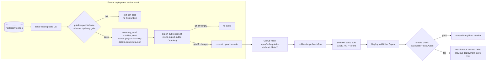

# Public-site publishing workflow

Companion to [roadmap Milestone 7](roadmap.md#milestone-7-privacy-and-publishing). That section says the design; this document is the operational detail an operator needs day to day — the full
pipeline, the review loop, and how to undo a bad publish. Tracks [issue #41](https://github.com/azusachino/iroha/issues/41).

## Pipeline

Every step left of the GitHub push happens inside the private network; nothing there is reachable from the public internet. The exported activity, summary, route, and detail files are sanitized
projections. `activity-details.json` contains rich detail for every exported activity, including samples and laps when the source has them. Route traces are included by default; passing `--privacy` is
an explicit opt-in that omits every route trace while retaining activity metrics, samples, and laps.

### Validation gate

`publicexport.Validate` (`apps/iroha-server/pkg/publicexport/validate.go`) runs after the summary/activities/routes are built in memory and before anything is written to `--out`. It is a regression
gate, not a privacy-detection system: it catches a raw (non-`act_`-prefixed) activity ID, a negative metric, an `ended_at` before `started_at`, or an out-of-range coordinate — the shapes a future
change to `Activity`, `Summary`, or route sanitization would produce if it accidentally bypassed the sanitizer. A failure exits non-zero with no partial files on disk, so the cron script's `set -eu`
aborts before any `git add`/`commit`/`push`.

### Freshness

`meta.json` (`{"generated_at": "..."}`) is written alongside the data files. The public site reads it in `+page.ts` and shows "Data as of \<date\>" in the hero, so a visitor never mistakes the
snapshot for a live feed.

### CI smoke check

The last step of `.github/workflows/public-site.yml` curls the deployed `page_url` after `deploy-pages` and asserts:

- the `/iroha` base path root returns the expected title/heading text (confirms the base path and build landed correctly, not a 404 or a root-site default page)
- `data/meta.json`, `data/summary.json`, `data/activities.json`, `data/routes.geojson` are all fetchable under that base path
- `data/activity-details.json` is fetchable under that base path

A failure here fails the workflow run but does **not** take the site down — GitHub Pages keeps serving the last successful `deploy-pages` output until a later run supersedes it.

## Operator/editor review loop

There is deliberately **no human approval gate** between a data change and publish — that would turn a personal running/media archive into an editorial workflow it doesn't need, and it would fight the
whole point of a scheduled Job refreshing it unattended. The review loop is: automated checks first, human spot-check on suspicion, not a sign-off step per publish.

- **The validation gate** (above) is the first automated reviewer — most regressions never leave the private network.
- **The CI smoke check** is the second — most of what's left is caught right after deploy.
- **The deployment environment's generic Job monitor** should watch the exporter for suspension, no recorded run, or staleness past a max age. No application-specific monitor is required.
- **Manual spot-check**: visiting `https://azusachino.github.io/iroha/` after a schedule fires. There is no dashboard for "did today's export look right" beyond reading the numbers; that's an
  acceptable cost for a single-operator personal site.

## Rollback path

| Symptom                                                                                     | Action                                                                                                                                                                                              |
| ------------------------------------------------------------------------------------------- | --------------------------------------------------------------------------------------------------------------------------------------------------------------------------------------------------- |
| A published data snapshot looks wrong (bad numbers or an unexpected field)                  | `git revert` the offending `chore: refresh public-site data export` commit on `main` and push. The path filter on `public-site.yml` re-triggers on that push and redeploys the prior snapshot.      |
| The `public-site.yml` workflow itself is broken (bad build step, bad smoke-check assertion) | Fix forward on `main`, then re-run via `workflow_dispatch` — no data change is required to redeploy.                                                                                                |
| The export CronJob is pushing bad data repeatedly                                           | Suspend `iroha-export-public` using the deployment platform's normal scheduled-Job command. This stops further pushes while the export logic is fixed, without touching anything already published. |

A broken deploy is never an outage: GitHub Pages only replaces the live site on a _successful_ `deploy-pages` step, so a failed build or a failed smoke check leaves the previous good snapshot serving
traffic.

## Current rollout status

The GitHub Pages site and the `iroha-export-public` integration are live. The public site is available at [azusachino.github.io/iroha](https://azusachino.github.io/iroha/), and the k3s CronJob
refreshes the sanitized snapshot daily in `Asia/Tokyo`.

The exporter uses a dedicated sealed `iroha-export-public` Secret containing `IROHA_EXPORT_GITHUB_PAT`. The repository URL is ordinary non-secret configuration in the deployment environment; it is not
embedded in the PAT Secret and the existing `iroha-secrets` is not used for publishing.

## Deployment contract

The public repository contains the exporter and static site, but never the credential that publishes a snapshot. A deployment operator should:

1. Create a fine-grained GitHub token for this repository only, with `Contents: read and write` permission. Do not grant Actions, administration, or access to other repositories. Set an expiration and
   rotate it when it expires.
2. Store the token in the deployment platform's encrypted secret store and inject it as `IROHA_EXPORT_GITHUB_PAT` only into the exporter Job. Never commit, print, or paste the value into public issue
   trackers or chat.
3. Keep the exporter image and Job configuration in the deployment environment. The Job should run `ops/scripts/export-public-cron.sh`, which exports the sanitized archive and rich detail for every
   activity, validates it, and pushes only changed files under `apps/iroha-public-site/static/data/`. Use the export command's `--privacy` mode only when the owner intentionally wants to omit all
   route traces.
4. Verify the Job reaches `Complete`, then confirm the Pages workflow succeeds and [the public site](https://azusachino.github.io/iroha/) shows a current `Data as of` timestamp. A deployment-specific
   one-shot Job command may be used for this check; remove it afterward.

If the Job reports `couldn't find key IROHA_EXPORT_GITHUB_PAT`, the deployment Secret was not applied or the key was omitted. Fix the encrypted-secret configuration; do not add a plaintext Secret as a
workaround.
