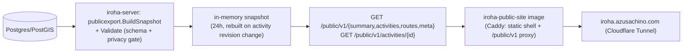

# Public-site publishing

Companion to [roadmap Milestone 7](roadmap.md#milestone-7-privacy-and-publishing). That section says the design; this document is the operational detail. Tracks
[issue #41](https://github.com/azusachino/iroha/issues/41).

The public site reads live data. `apps/iroha-public-site` is a static client shell that fetches the sanitized projection from iroha-server's anonymous `/public/v1` API in the browser (ADR-0008:
anonymous visitors see only the sanitized projection). There is no export job, no builder job, and no data baked into the build.

Earlier designs committed a snapshot to `main` for GitHub Pages, then exported to a volume that a nightly builder job compiled into a static site. Both are retired.

## Pipeline

```mermaid
flowchart LR
    DB[(Postgres/PostGIS)] --> SNAP["iroha-server: publicexport.BuildSnapshot<br/>+ Validate (schema + privacy gate)"]
    SNAP --> CACHE["in-memory snapshot<br/>(24h, rebuilt on activity revision change)"]
    CACHE --> API["GET /public/v1/{summary,activities,routes,meta}<br/>GET /public/v1/activities/{id}"]
    API --> SITE["iroha-public-site image<br/>(Caddy: static shell + /public/v1 proxy)"]
    SITE --> LIVE["iroha.azusachino.com (Cloudflare Tunnel)"]
```

- **Endpoints.** `summary`, `activities`, `routes`, and `meta` come from one validated snapshot. `activities/{id}` returns one activity's route, samplings, and laps, and the site fetches it only when
  an activity is opened.
- **Validation gate.** `publicexport.Validate` and `ValidateActivityDetails` run before anything is served. A failure returns `500 public_unavailable`; unsanitized data is never served. The gate
  catches a raw (non-`act_`) ID, a negative metric, an `ended_at` before `started_at`, or an out-of-range coordinate: the shapes a change that bypassed the sanitizer would produce.
- **Route traces are public with privacy protections.** By owner decision (2026-09-28), public routes and details apply endpoint privacy trimming (the first and last 200m are dropped to prevent pinpointing home/work locations; tracks under 400m are omitted) and coordinate rounding to 5 decimal places (~1.1m precision) to remove micro-precision tracking.
- **Caching.** The server keeps the snapshot for up to 24 hours, keyed on the activity revision, so a new or changed activity is visible on the next request and anonymous traffic cannot force a
  rebuild. Responses send `Cache-Control: public, max-age=86400`, so a browser that already loaded the site may show data up to a day old.
- **Limits.** 120 requests/minute per client; GET only; any origin may read.
- **Isolation.** The site's Caddy proxies only `/public/v1/*`. The private `/api/v1` is not reachable through it.

## Rollback

| Symptom                               | Action                                                                                                                                                        |
| ------------------------------------- | ------------------------------------------------------------------------------------------------------------------------------------------------------------- |
| Public numbers look wrong             | Check `iroha-server` logs for `build public projection`, fix the data or the projection, and the next request rebuilds it once the activity revision changes. |
| A site release is broken              | Roll the `iroha-public-site` image pin back in the deployment repo.                                                                                           |
| `/public/v1` must go dark immediately | Scale `iroha-public-site` to zero in the deployment repo; the server keeps serving the private app.                                                           |

## Local development

`make public-site-dev` and `make public-site-preview` proxy `/public` to the local iroha-server (`IROHA_DEV_API_TARGET`, default `http://127.0.0.1:8080`), so the site shows whatever the local database
holds. The `iroha-export-public` CLI (`make export-public`) still writes a static snapshot to disk for manual inspection.

## Deployment contract

1. Build and deploy the `iroha-public-site` image (`make image-public-site`) with `IROHA_SERVER_UPSTREAM` pointing at iroha-server.
2. Let the public site's pods reach iroha-server on its HTTP port.
3. Verify that `https://iroha.azusachino.com/` loads, opening an activity loads its detail, and `/api/v1/…` on the public host returns the site shell rather than private data.
