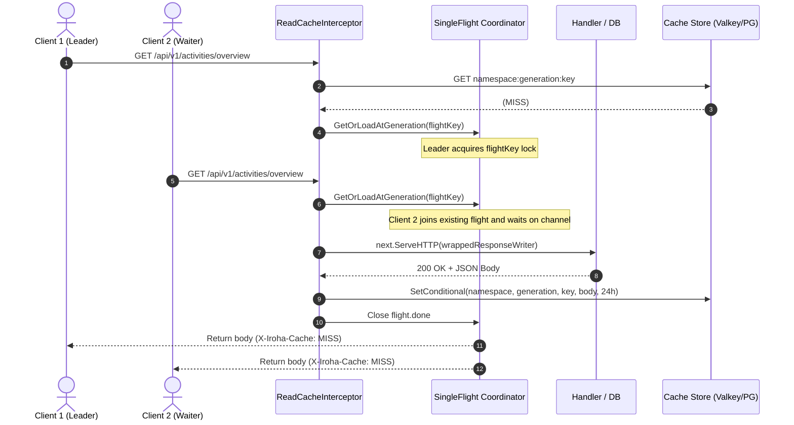
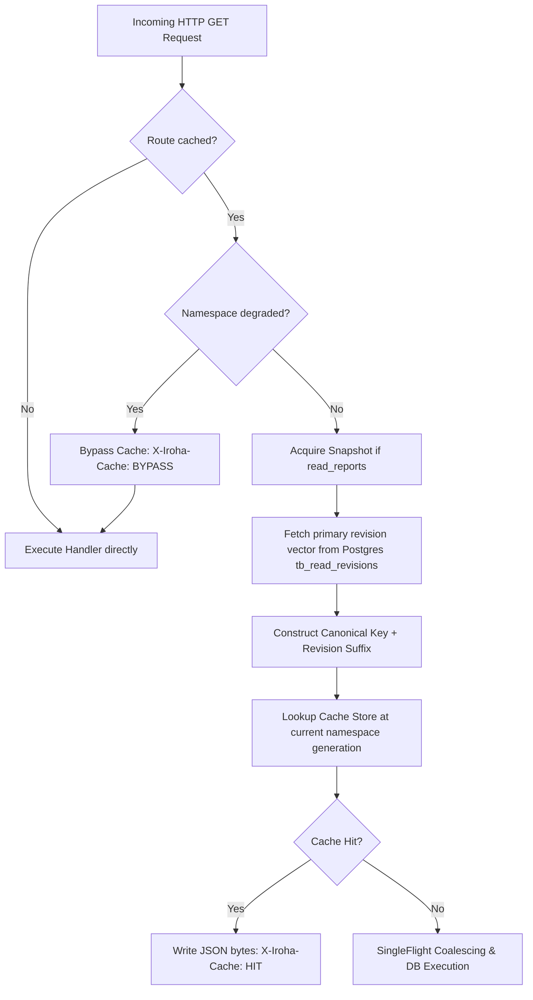
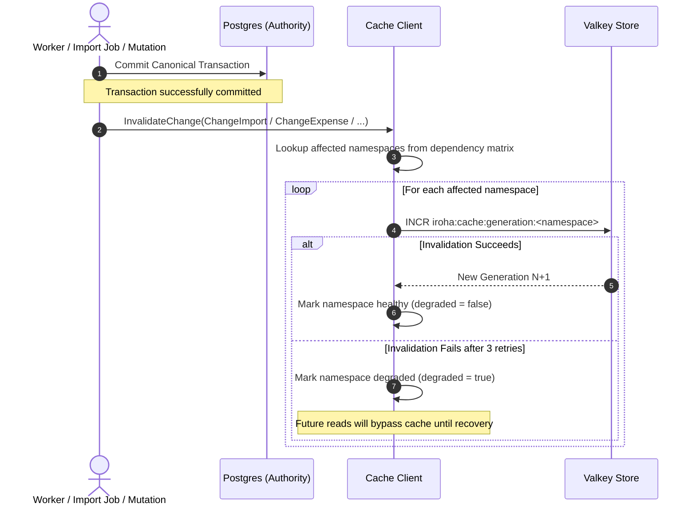
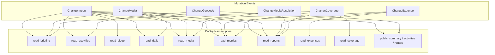

# Read Cache Architecture & Lifecycle

## 1. Architectural Rationale: Why an HTTP Interceptor?

The Iroha read cache is implemented as an edge HTTP middleware/interceptor (`ReadCacheInterceptor` in `apps/iroha-server/pkg/httpapi/read_cache.go`) wrapping `/api/v1` read routes, rather than at the database repository or service layer.

### Design Benefits

1. **Wire-Ready Byte Caching (Zero Serialization Overhead)**:
   - On a cache hit, the server writes pre-marshaled JSON `[]byte` directly to the `http.ResponseWriter`.
   - Domain structs, ORM models, and JSON serialization are completely bypassed, eliminating heap allocations and GC overhead on high-frequency reads.
2. **End-to-End Snapshot Isolation for Composite Reads**:
   - Complex reporting endpoints (`/api/v1/reports/*`) query multiple tables (activities, sleep, daily metrics, expenses).
   - The interceptor initiates a PostgreSQL `REPEATABLE READ READ ONLY` transaction before invoking downstream handlers, guaranteeing all sub-queries see a consistent snapshot without torn data.
3. **Fail-Open Isolation**:
   - Any non-`200 OK` status, empty body, or non-JSON content type is rejected by `readCacheResponseWriter` and never cached. Unsuccessful responses retain their individual request contexts and headers.
4. **Single-Flight Miss Coalescing**:
   - Concurrent requests for the same namespace, key, and generation coalesce into a single backend execution via `cache.GetOrLoadAtGeneration`, shielding PostgreSQL from cold-start stampedes.

---

## 2. Cache Strategy by Data Type

| Cache Namespace | Endpoints / Data Types | Isolation Strategy | Key Normalization & Revision Tracking | Invalidation Triggers |
| :--- | :--- | :--- | :--- | :--- |
| **`read_reports`** | `/api/v1/reports/monthly`, `/api/v1/reports/monthly-series` | **Database Snapshot**: Binds `REPEATABLE READ READ ONLY` transaction to context | Full calendar scope normalization; includes revision vectors from `tb_activities`, `tb_sleep_records`, `tb_expenses`, etc. | `ChangeImport`, `ChangeMedia`, `ChangeExpense`, `ChangeMediaResolution`, `ChangeCoverage` |
| **`read_activities`** | `/api/v1/activities`, `/overview`, `/summary`, `/bounds`, `/routes`, `/{id}` | Direct canonical Postgres read | Canonical date range (`from`/`to`/`date`/`scope`), effective timezone | `ChangeImport`, `ChangeGeocode` |
| **`read_sleep`** | `/api/v1/sleep`, `/overview`, `/aggregates`, `/bounds`, `/{id}` | Direct canonical Postgres read | Canonical date range, effective timezone | `ChangeImport` |
| **`read_daily`** | `/api/v1/daily`, `/dates`, `/bounds`, `/aggregates` | Direct canonical Postgres read | Canonical date range, effective timezone | `ChangeImport`, `ChangeMedia` |
| **`read_expenses`** | `/api/v1/expenses`, `/bounds`, `/{id}` | Direct canonical Postgres read | URL query parameters, effective timezone | `ChangeExpense` |
| **`read_media`** | `/api/v1/media`, `/aggregates`, `/events`, `/changes`, `/{id}` | Direct canonical Postgres read | URL query parameters, effective timezone (excludes sync commands) | `ChangeImport`, `ChangeMedia`, `ChangeMediaResolution` |
| **`read_metrics`** | `/api/v1/metrics`, `/{metricId}`, `/series` | Direct canonical Postgres read | Canonical date range, effective timezone, metric definition version | `ChangeImport`, `ChangeMedia`, `ChangeExpense`, `ChangeCoverage` |
| **`read_briefing`** | `/api/v1/briefing` | Direct canonical Postgres read | Target date, effective timezone | `ChangeImport`, `ChangeMedia`, `ChangeCoverage` |
| **`read_coverage`** | `/api/v1/coverage` | Direct canonical Postgres read | Query parameters | `ChangeCoverage` |
| **`public_*`** | `/public/v1/*` (summary, activities, routes) | Memory snapshot + Valkey cache | Sanitized public projection | `ChangeImport`, `ChangeGeocode` |

---

## 3. Cache Lifecycles

### Lifecycle 1: Creation & Cold Miss (Single-Flight Coalescing)

When a request arrives and misses in the cache:

1. Key identity is formed: `Version + Method + Path + CanonicalQuery + EffectiveTimezone + RevisionVector`.
2. A fast-path cache probe checks Valkey/Postgres at the current generation.
3. On miss, `GetOrLoadAtGeneration` registers a `flightKey` struct `{namespace, key, generation, typeID}`.
4. Concurrent incoming requests with the same `flightKey` join the leader's flight channel instead of querying the database.
5. The leader executes the handler, buffers the response via `readCacheResponseWriter`, and commits it conditionally to the cache backend at the recorded generation.
6. The leader closes `flight.done`, releasing all waiting requests with the resulting payload.

---

### Lifecycle 2: Read / Cache Hit / Stale Detection

- **Revision Vector Invalidation**:
  When Postgres data changes, the revision counter advances in `tb_read_revisions`. This instantly alters the cache key (`|revision:tb_activities=42`), so existing cache keys are ignored without requiring proactive backend deletion.
- **Generation Invalidation**:
  Valkey namespace generations ensure that in-flight loads targeting an older generation cannot overwrite freshly invalidated data.

---

### Lifecycle 3: Invalidation & Dependency Triggers

Invalidations occur post-commit after canonical writes or import completions. The invalidator increments the namespace generation counter and clears old entries.

### Dependency Trigger Matrix (`changeNamespaces`)

